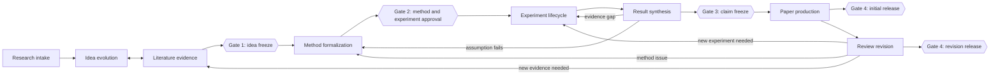
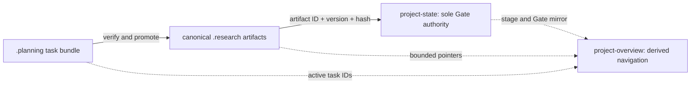

# Scientific Research Skill

面向 Codex 的可审计科研工作流基础库。第一轮整合以 **Claude Scholar 的流程/证据骨架** 为主，吸收 **EvoScientist 官方 Skill 包 EvoSkills 的 idea–experiment 迭代**、**Nature Skills 的统计/写作/审稿回复**，并对 **agent-research-skills 的形式化与追溯思想进行 clean-room 重构**。

> 当前状态：第一轮基础组织（Alpha）。已提供 Codex plugin、默认 Planning with Files、公共 workflow hook 和可审计 artifact chain；RL、LLM、无人机控制、个人实验习惯和目标 venue 尚未进行第二轮个性化定制。

## 目标

这个仓库不是把四个上游仓库全部安装到一起，而是建立一个稳定的个人母库：

- 每个科研阶段有明确入口、输入、输出和退出条件；
- idea、文献、方法、实验、结果、论文和返修能通过统一 artifacts 交接；
- 关键结论可向后追溯到论文原文、实验 run、分析代码和具体修改；
- agent 可以执行和迭代，但 idea freeze、实验方案、claim freeze 和外部提交由研究者审批；
- 上游快照与本地组合层分离，便于后续同步和高度定制。

## 总流程



它是带反馈边的 state machine，不是强制一次走完的瀑布流程。

## 八个组合 Skill

| Skill | 作用 | 主要产物 |
| --- | --- | --- |
| `$research-orchestrator` | 恢复项目概览、维护执行计划、判断阶段、组织 agents 和 gate | `project-overview.md`, `project-state.yaml`, `.planning/<task-id>/` |
| `$idea-evolution` | 生成、反证、比较、优化并冻结 idea | `idea_card.yaml` |
| `$literature-evidence` | 搜索、筛选、精读、closest-work 与 novelty 证据 | `search_protocol.yaml`, `evidence_matrix.jsonl` |
| `$method-formalization` | 假设、数学、算法、接口与 math↔code 映射 | `method_contract.md` |
| `$experiment-lifecycle` | 实验矩阵、执行登记、故障诊断与迭代 | `experiment_matrix.yaml`, `run_registry.jsonl`, `decision_log.yaml` |
| `$result-synthesis` | 统计、图表、负结果与 claim promotion | `analysis_registry.yaml`, `artifact_manifest.yaml`, `claim_ledger.yaml` |
| `$paper-production` | 从冻结 claims 组装、编译和审计论文 | `paper_claim_map.yaml`, `paper_change_map.yaml` |
| `$review-revision` | reviewer concern→证据→修改→回复闭环 | `review_map.yaml`, `revision_change_log.yaml` |

每个目录都符合 Codex Skill 结构：`SKILL.md`、`agents/openai.yaml` 和按需加载的 `references/`。

## 统一 artifact chain

默认把科学状态和执行状态分开：



科学 artifact chain 为：

```text
.research/idea/idea_card.yaml
    ↓
.research/literature/{search_protocol.yaml,paper_registry.jsonl,
                      evidence_matrix.jsonl,closest_work.md}
    ↓
.research/method/method_contract.md
    ↓
.research/experiments/{experiment_matrix.yaml,run_registry.jsonl,
                       decision_log.yaml}
    ↓
.research/results/{analysis_registry.yaml,artifact_manifest.yaml,
                    claim_ledger.yaml}
    ↓
.research/paper/{paper_claim_map.yaml,paper_change_map.yaml}
    ↓
.research/revision/{review_map.yaml,revision_change_log.yaml}
```

机器可读的唯一路径目录是 [contracts/artifact-catalog.yaml](contracts/artifact-catalog.yaml)，模板位于 [contracts](contracts/)。若现有项目已有等价文件，不要求重复创建，只需在 `project-state.yaml` 中建立映射。

`project-state.yaml` 是 Gate 状态的唯一事实来源。批准/重开记录必须绑定 artifact ID、version 和 content hash；idea、method、experiment 或 claim 文件只能保存 `gate_ref`，不能自行声明已获批准。Gate 4 分别支持初次投稿和 revision/rebuttal release，不要求初次投稿先经过 review 阶段。

`Planning with Files` 现在是非平凡科研任务的默认执行层。每个任务使用 `.planning/<task-id>/task_plan.md`、`findings.md` 和 `progress.md` 保存步骤、临时发现、失败、agent handoff 与恢复状态；它不能出现科学意义上的 `approved`，也不能直接作为论文证据。只有经过来源、run 或代码验证的结果才能 promotion 到 `.research/`，之后才可能进入 Gate。

`.research/project-overview.md` 是一页式派生导航：镜像当前阶段、Gate decision IDs、artifact 指针、bounded claims、约束、术语、开放问题和 active tasks。它不保存独立批准或原始证据；与 `project-state.yaml` 冲突时以后者为准。

## 四个上游的职责

| 上游 | 第一轮角色 | 引入方式 |
| --- | --- | --- |
| [Galaxy-Dawn/claude-scholar](https://github.com/Galaxy-Dawn/claude-scholar) | 工作流、research contract、结果报告、ML 写作、publication chart | 固定 Codex 分支快照，MIT |
| [EvoScientist/EvoScientist](https://github.com/EvoScientist/EvoScientist) + [官方 EvoSkills](https://github.com/EvoScientist/EvoSkills) | 前者提供 runtime 设计参考；科研 Skill 实体来自后者，包括 idea 迭代、paper planning、实验 pipeline、失败诊断和经验记忆 | core 不复制；EvoSkills 固定快照，Apache-2.0 |
| [Yuan1z0825/nature-skills](https://github.com/Yuan1z0825/nature-skills) | 统计、Nature 风格写作、reviewer response、共享契约 | 固定快照，Apache-2.0 |
| [lingzhi227/agent-research-skills](https://github.com/lingzhi227/agent-research-skills) | atomic decomposition、math/code mapping、traceability 等设计启发 | 当前快照未发现仓库许可证，不复制源码，仅 clean-room 重构 |

精确 commit、选择边界和 caveats 见 [upstreams.lock.yaml](upstreams.lock.yaml)、[THIRD_PARTY_NOTICES.md](THIRD_PARTY_NOTICES.md) 与各 `vendor/*/UPSTREAM.md`。

Vendored 内容保持原样，不会被注册或路由为可调用 Skill；真正供 Codex 使用的组合层位于 `skills/`。完整 plugin bundle 会保留这些上游快照用于许可证归属与审计，兼容的 skill-only installer 则只复制 `skills/`。

EvoScientist 主仓是 agent runtime，而不是完整科研 Skill 包；因此本轮没有搬运其 LangGraph/TUI/WebUI 等产品代码，只记录架构出处，并从其官方 companion repository EvoSkills 选择科研流程。

### 两项许可证排除的准确含义

- **lingzhi / agent-research-skills：**排除的是未经许可证授权的源码、prompt、脚本和 assets 的复制或再分发；atomic decomposition、math↔code mapping、traceability 等能力没有被删除，而是只依据公开思想进行独立 clean-room 实现。
- **Claude Scholar venue 模板：**排除的仅是 `ml-paper-writing/templates/**` 中带独立 LPPL/再分发条件的 LaTeX style、BST、PDF 等模板包；`ml-paper-writing/SKILL.md`、写作流程和 references 仍保留。实际投稿时应从目标 venue 官方来源获取当期模板。

这两项许可证边界均与 Planning with Files 无关。

## 快速开始

```bash
git clone https://github.com/Fusica/Scientific-Research-Skill.git
cd Scientific-Research-Skill

python3 -m pip install -r requirements-dev.txt
python3 scripts/validate_repo.py
node --test tests/hooks.test.js

codex --version
codex plugin marketplace add "$PWD"
codex plugin add scientific-research-skill@scientific-research-skill
```

Plugin 安装同时提供八个 Skill 和 `SessionStart` / `UserPromptSubmit` 公共 hook。首次安装或 hook 内容改变后，需要在 Codex 的 hook 管理界面显式信任这两个 hook；这是 Codex 的安全边界，仓库不会静默绕过。Node.js 是 hook runtime 的显式依赖，缺失时应显示 Hook failure。

公共 hook 只在从当前目录向上找到 `.research/project-state.yaml` 时启用；这是研究项目的 opt-in marker，普通 Git/代码仓库保持 no-op。研究项目初始化后，新开 thread 会注入解析后的 project ID、stage、Gate decision 和 overview 中明确声明的 active-task 元数据；项目正文不被提升为 hook policy。每次 prompt 都会重申 Planning 与 scientific Gate 的职责边界。

Hook 的事件、只读保证、信任与验证流程见 [docs/codex-plugin.md](docs/codex-plugin.md)。

若只想安装 Skill、明确不需要公共 hook，可使用兼容模式：

```bash
python3 scripts/install_codex.py --mode link
python3 scripts/install_codex.py --mode copy
```

Skill-only 安装默认写入 `$CODEX_HOME/skills`（未设置时为 `~/.codex/skills`），不会激活强制 hook。安装器不会覆盖已有同名 Skill，除非显式传入 `--force`；覆盖前会创建带时间戳的备份。

## 使用方式

完整项目从 orchestrator 开始：

```text
Use $research-orchestrator to inspect this repository, initialize the
research state, and tell me the next evidence-backed stage.
```

也可以直接调用单一阶段：

```text
Use $idea-evolution to challenge and refine this UAV-control research idea.
Use $review-revision to map these comments to evidence and manuscript edits.
```

非平凡科研任务默认先创建或复用 Planning 三件套，再使用最小适用 Skill；简单事实问答、单句改写和微小格式调整可以不创建 planning bundle，也不必初始化整条科研流水线。

## 目录

```text
.codex-plugin/ # Codex plugin manifest
.agents/       # Codex marketplace descriptor
hooks/         # 公共 workflow guard
skills/        # 本地组合层
contracts/     # 科学 artifacts、project overview 与 planning 模板
profiles/      # 领域、venue、agent 策略；第一轮仅提供基线
vendor/        # 经过许可审查的只读上游快照
docs/          # 架构、执行流程和下一轮定制路线
scripts/       # 兼容安装与仓库校验
tests/         # 结构、契约和 hook 行为测试
```

## 第一轮明确不做的事

- 不声称仅靠 Skill 即可保证顶刊论文质量；
- 不使用 citation count 判断论文贡献类型或 novelty；
- 不把 LLM 自评/Elo 当作 idea 的最终科学裁决；
- 不套用上游通用的 seed、方差、提升幅度或 attempt budget；
- 不复制缺少明确许可证的上游源码；
- 不再分发 Claude Scholar 中含独立条款的 venue/LaTeX 模板，使用时从官方 venue 获取；
- 不引入体积较大的 Nature figure assets；
- 不在尚未确定个人工具链前绑定 W&B/MLflow、Slurm、ROS2/PX4 或特定 simulator；
- 不在第一轮固化 RL、LLM、UAV 和 venue 的细粒度协议。

## 下一轮定制

下一轮建议围绕真实科研实践讨论并冻结：

1. RL、LLM、UAV/control 三类 domain profiles；
2. 常用仿真、实机、训练、调参和实验追踪工具；
3. idea 评审维度、kill criteria 和个人经验沉淀规则；
4. NeurIPS/ICML/ICLR、ICRA/IROS/RSS/CoRL、RA-L/T-RO 等 venue profiles；
5. 论文数字反向溯源、自动编译/视觉 QA、rebuttal 一致性检查；
6. 项目级 memory 与跨项目经验库的边界。

详见 [docs/customization-roadmap.md](docs/customization-roadmap.md)。

## License

本地组合层使用 Apache License 2.0。Vendored 内容继续遵循各自上游许可证；具体归属见 [THIRD_PARTY_NOTICES.md](THIRD_PARTY_NOTICES.md)。
