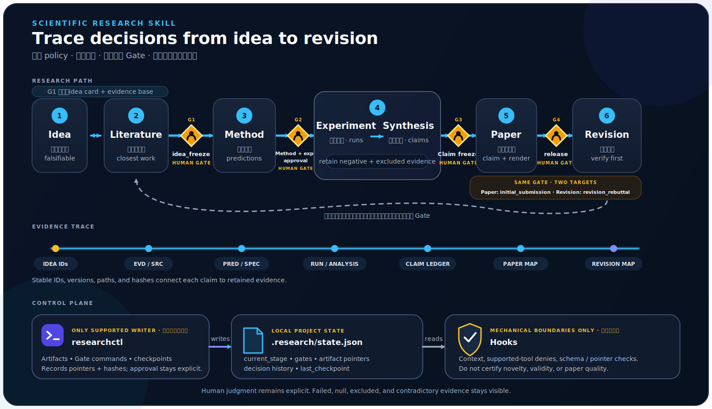

<p align="center">
  
</p>

<h1 align="center">Scientific Research Skill</h1>

<p align="center">
  <strong>让研究判断、证据、实验与写作之间的关系清楚、可恢复、可审计。</strong>
</p>

<p align="center">
  <a href="#安装">安装</a> ·
  <a href="#六阶段与四个-gate">科研流程</a> ·
  <a href="#参与使用与共建">参与共建</a>
</p>

一个面向 Codex 的项目级科研 Plugin：用一个 `$research` 入口贯通 idea、文献、方法、实验与结果、论文、返修六个阶段，同时用确定性命令维护 Gate，用 Hook 约束可机械判断的越界行为。

仓库不承诺自动产出“顶刊论文”，而是让研究判断、证据、实验和写作之间的关系清楚、可恢复、可审计。

## 核心结构

```text
Codex Plugin
├── Skill: $research                 唯一对话入口与阶段路由
├── Rules: references/policy.yaml    唯一流程、artifact role、Gate 和退出条件
├── Schema: assets/runtime-contract.json  Python/Hook/template 共用机器结构
├── Command: scripts/researchctl.py  唯一状态、revision 与 Gate 写入口
├── Hooks                            项目上下文、工具边界、停止前复核
└── Project data: .research/         当前项目的本地状态、记忆与工作流产物
```

`scripts/researchctl.py` 是唯一公开命令与 state 写入口。`policy.yaml` 定义科研工作流，`runtime-contract.json` 定义固定机器 schema；Python、Hook 与 state template 共同消费后者，不增加第二套 state 或写入口。

已接受的维护者设计决策记录在 [`decisions/`](decisions/)，当前术语与“已实现／仅意图／明确延期”的能力区别见 [`decisions/glossary.md`](decisions/glossary.md)。这些文件不属于 Plugin runtime 或项目研究状态。

## 能力声明边界

能力等级描述的是有证据支撑的**过程能力**，不是科研结果质量。任何公开的六维比较都必须同时标明系统边界（`Core` 或 `Core + Reference Stack`）、证据状态（`Current`、`Target` 或 `Benchmark-verified`），以及验证版本、语料、日期和报告。完整定义与取舍见 [`ADR 0002`](decisions/0002-evidence-qualified-capability-claims.md)。

下面是 vNext 的验收目标，当前状态全部是 **Target**，不能表述为当前版本已经达到：

| 维度 | 系统边界 | Target |
| --- | --- | --- |
| 流程治理 | Core | 很高 |
| 项目级审计 | Core | 很高 |
| 实验执行 | Core + Reference Stack | 端到端很高 |
| 论文生产与投稿准备 | Core + Reference Stack | 端到端很高 |
| 知识管理 | Project-local Core | 高 |
| 创新激发流程 | Track A: Core；Track A + B: declared native stack | 接近 EvoSkills／接近 Evo 完整生态 |

“高”要求声明范围内流程完整、证据可追溯、关键失败可恢复，并通过确定性与代表性场景验收；“很高”还要求声明边界内的端到端闭环，以及适用的跨阶段、适配器、故障恢复、对抗性和离线审计证据。“接近 Evo”只来自冻结双轨 benchmark 的统计非劣效结论，不是“很高”的同义词。通过 Track A 只能声明 Core 创新激发流程接近 EvoSkills；Track A 与 Track B 均通过后，才能声明端到端流程接近 EvoSkills + EvoScientist 生态。

上述标签不保证科研正确性、统计有效性、真实创新、论文质量或录用。投稿能力止于可审计的投稿准备包；实际外部投稿、昂贵计算、破坏性操作、安全相关硬件执行以及所有 Gate 和 lifecycle 决策仍保留既有人工权限边界。

## 六阶段与四个 Gate

<p align="center">
  
</p>

上图只表示主路径与关键边界；回退、Gate 重开和完整转换条件以 [`skills/research/references/policy.yaml`](skills/research/references/policy.yaml) 为准。

每个 Gate 都要求研究者明确批准或重开。模型不能把沉默、任务完成或一段积极表述解释成批准。

`release` 是同一个 Gate 的两个发布目标：首次批准 `initial_submission` 后进入 Revision；返修完成后，还要针对 `revision_rebuttal` 再次明确批准。Gate 批准只记录决策与绑定证据，不会代替研究者执行投稿或发布。

一个 workspace 对应一篇论文的一条研究主线，主线由研究问题与预期核心贡献共同界定。`release` 是可重复事件，不等于项目完成；研究者可从任意阶段有证据地 `terminate`，或在论文周期确实结束后 `complete`。两种终态都只读保护并保留阶段与历史，只有同一主线可显式 `reopen`；新论文或核心贡献变化使用新的 workspace。跨 workspace 只按值复制并重新登记数据及 provenance，不继承任何 Gate、claim 或 lifecycle 判断。

| 阶段                 | 主要职责                                                           |
| -------------------- | ------------------------------------------------------------------ |
| Idea                 | 在一份 portfolio 中生成、比较、淘汰并选择候选                     |
| Literature           | 背景搜索、closest work、证据矩阵、novelty 边界与 idea 迭代         |
| Method               | 在一份 approval package 中比较方法并形式化所选方法                 |
| Experiment + Results | 基线、实验矩阵、执行记录、失败诊断、统计分析与 Claim—Evidence 对齐 |
| Paper                | 结构、写作、数字与引用追溯、自审、编译和投稿检查                   |
| Revision             | reviewer concern、补充证据、论文修改与逐点回复闭环                 |

Idea 和 Method 都允许在 Gate 前保留多个候选。候选使用稳定 ID、parent lineage 和 `active`、`shortlisted`、`selected`、`rejected`、`falsified` 状态，并保留支持/反对证据、kill criteria 与选择或淘汰理由。`idea_freeze --selected-id IDEA-003` 和 `method_experiment_approval --selected-id METHOD-002` 记录的是 portfolio 内部的科研候选 ID；Gate 另行绑定唯一 portfolio artifact 的当前 revision。runtime 不解析科研 Markdown，也不会替研究者判断候选是否存在、是否新颖或是否值得选择。

项目只有一套全局 `current_stage` 与 GateRef，不是多分支引擎。transition、reopen、cascade 与 release target 以 [`policy.workflow_graph` 和 `policy.gates`](skills/research/references/policy.yaml) 为唯一语义来源，机器历史字段以 [`runtime-contract.json`](skills/research/assets/runtime-contract.json) 为准。

artifact revision、snapshot、稳定 ID/path 和 manifest 规则只由 `policy.artifact_layout` 定义；各阶段 reference 只说明本阶段 artifact 的科学内容与更新时机。

文献检索保持 provider-neutral 的 search-run、raw-snapshot Hash、筛选和 passage-level evidence 契约；论文阶段继续显式声明构建与 bibliography toolchain，保留 clean-build 日志并检查渲染输出，不把某个数据库、tracker、模板、引擎或目录结构写死。

## 安装

Plugin 在每台 Codex 主机安装一次，研究流程按项目单独启用。

这是 Codex 当前的安装边界：marketplace 可以来自项目或 Git 仓库，但已安装 bundle 缓存在主机用户目录；项目隔离由 `.research/state.json` 的显式启用实现。参见 [Build plugins](https://developers.openai.com/codex/plugins/build)。

从 GitHub marketplace 安装：

```bash
codex plugin marketplace add Fusica/Scientific-Research-Skill
codex plugin add scientific-research-skill@scientific-research-skill
```

本地开发安装：

```bash
git clone https://github.com/Fusica/Scientific-Research-Skill.git
cd Scientific-Research-Skill
codex plugin marketplace add "$PWD"
codex plugin add scientific-research-skill@scientific-research-skill
```

首次安装或 Hook 内容变化后，在 Codex 中检查并信任 Hook，然后新建 thread。文件存在并不代表 Hook 已经被信任或运行。

## 项目启用

在待研究项目根目录执行：

```bash
python3 /path/to/Scientific-Research-Skill/scripts/researchctl.py init
```

也可以在 Codex 中明确调用：

```text
Use $research to initialize this repository and report the current research stage.
```

初始化创建：

```text
.research/
├── state.json      # lifecycle、监管开关、阶段、Gate、revision 与检查点
├── memory.md       # 研究内核、事实、决策、失败经验和下一步
├── artifacts/      # 稳定 working artifact
│   └── <stage-id>/ # 按阶段维护，路径不随 revision 改名
└── snapshots/      # register 自动生成的不可变完整 revision
    └── <stage-id>/ # 不手工编辑
```

`.research/` 默认写入当前 clone 的 `.git/info/exclude`，因此状态、记忆、working artifacts 与 snapshots 都不提交 Git、也不跨服务器同步。`init` 是幂等的，不覆盖兼容的 state 或 memory；若现有 state 已禁用，使用 `researchctl enable --reason "恢复 Plugin 监管"`。已有源码、论文和小型结果可以保留在原位置作为稳定 source path；其 registered revisions 由 `researchctl` 保存完整 snapshots，不要求把 working file 搬进 `.research/artifacts/`。

v2 不迁移 v1 state。升级前先人工保全仍需使用的研究材料；然后删除旧项目的整个 `.research/`，使用 v2 `researchctl init` 重新初始化，并按新契约重新登记 canonical artifacts。不要把 v1 Gate approval 当作 v2 approval，也不要手工改写旧 state 来伪造迁移。

```bash
# 仅在已保全所需材料并确认当前 runtime 为 v2 后执行
rm -rf .research
python3 /path/to/Scientific-Research-Skill/scripts/researchctl.py init
```

`.research` 中需要人工审核的中间产物、持久化 memory、checkpoint summary 和 Gate reason 默认采用中文骨干。论文、返修回复、代码及注释等正式输出保持英文；JSON/YAML 字段、ID、枚举、路径、命令、公式、原始引文、书目信息和原始日志保持英文或原文。该规则只影响后续新写内容，不翻译或重写已有 artifact。

不存在 `.research/state.json`、状态无法解析或 `enabled` 为 `false` 时，公共 Hook 严格输出 `{}`，普通项目不受影响。

## `researchctl`

下面用 `researchctl` 简写 `python3 <plugin-root>/scripts/researchctl.py`：

```bash
researchctl init
researchctl status
researchctl status --json
researchctl enable --reason "恢复 Plugin 监管"
researchctl disable --reason "临时退出 Plugin 监管"
# 下列数组是每条 Gate/lifecycle 根决策都必须携带的结构化答辩参数
decision_review=(
  --supporting-evidence-id EVID-001
  --decision-condition "证据边界改变时停止或重开"
)
researchctl artifact register idea_card \
  --stage idea --path .research/artifacts/idea/idea-portfolio.md \
  --artifact-id IDEA-PORTFOLIO-001
researchctl gate approve idea_freeze --selected-id IDEA-003 \
  --reason "人工选择 IDEA-003；已核对最近工作、可行性与否证条件" \
  "${decision_review[@]}"
researchctl artifact register approval_package \
  --stage method --path .research/artifacts/method/method-approval-package.md \
  --artifact-id METHOD-PORTFOLIO-001
researchctl gate approve method_experiment_approval --selected-id METHOD-002 \
  --reason "人工选择 METHOD-002；已核对方法合同与实验设计" \
  "${decision_review[@]}"
researchctl gate approve claim_freeze --retrospective-revision-import \
  --reason "人工确认：这是工作流启用前已完成稿件的返修接入，并接受已记录的历史证据缺口" \
  "${decision_review[@]}"
researchctl gate reopen claim_freeze --reason "新评估结果使冻结表述失效" "${decision_review[@]}"
researchctl gate approve release --target initial_submission --reason "人工批准首次投稿包" "${decision_review[@]}"
researchctl gate approve release --target revision_rebuttal --reason "人工批准返修回复包" "${decision_review[@]}"
researchctl lifecycle terminate --reason "证据支持停止该研究主线" "${decision_review[@]}"
researchctl lifecycle complete --reason "研究者确认论文周期结束" "${decision_review[@]}"
researchctl lifecycle reopen --gate claim_freeze --reason "新证据影响冻结 Claim" "${decision_review[@]}"
researchctl checkpoint --summary "基线已复现，下一步运行所提方法"
researchctl checkpoint --summary "开始执行已登记的文献检索" --stage literature
researchctl dashboard
researchctl dashboard --verify
researchctl dashboard --open
researchctl doctor
```

`dashboard` 按需原子生成 `.research/dashboard.html`：这是一个离线、只读的 state 投影，展示 lifecycle、监管开关历史、六阶段焦点、合法回退、Gate 与 release target、机械缺失角色、artifact 当前 revision 和历史时间线；项目记忆仍只存在 `.research/memory.md`。默认只做结构检查；`--verify` 同时核验 revision snapshots 与 Hash，`--open` 在生成后尝试用默认浏览器打开。页面不写 state、不审批 Gate，也不判断 novelty 或科研充分性；状态变化后重新运行该命令即可刷新。

artifact、revision、snapshot、cardinality 与大文件 manifest 的唯一语义合同在 [`policy.artifact_layout`](skills/research/references/policy.yaml)；机器字段与限制在 [`runtime-contract.json`](skills/research/assets/runtime-contract.json)。公共写入只通过 `researchctl`，`.research/state.json`、lock、memory 和派生 Dashboard 都不是科研证据。

### 类型化科研记录

`record_manifest` 的权威语义只在 [`policy.artifact_layout`](skills/research/references/policy.yaml)、[`runtime-contract.json` 的 `scientific_record`](skills/research/assets/runtime-contract.json) 和 [ADR 0003](decisions/0003-registered-scientific-record-manifests.md) 中定义。下面只是非规范用法示例：

```json
{
  "schema_version": "1.0",
  "stage": "idea",
  "records": [
    {
      "record_id": "IDEA-001",
      "record_kind": "candidate",
      "source": {
        "artifact_role": "idea_card",
        "artifact_id": "IDEA-PORTFOLIO-001",
        "revision": 1,
        "locator": "#idea-001"
      },
      "supersedes": null,
      "relations": []
    }
  ]
}
```

```bash
researchctl artifact register record_manifest --stage idea \
  --path .research/artifacts/idea/record-manifest.json \
  --artifact-id IDEA-RECORDS-001
researchctl doctor
```

`artifact register` 与 `doctor` 都按上述权威合同检查；记录仍只是普通 registered artifact，state 不增加顶层 record store。科学判断与后续 Trace Graph 边界见 ADR，不由 README 增补规则。

Gate、GateRef、stage transition、release target 与条件化 approval mode 同样只由 policy 定义，decision/cascade 的机器形状只由 runtime contract 定义。`contract_version: 2.0` 的 writer-owned 字段与分支枚举会在加载时 fail closed；可选 decision 字段可以向后兼容扩展，破坏性字段改名或删除必须升级 contract version 与 runtime，不能先加载成功再在 writer/doctor 阶段失败。CLI 的通用入口是 `--approval-mode <policy-key>`；`--retrospective-revision-import` 只是由 policy `cli_flag` 生成的兼容别名，不再决定内部 mode ID。README 只展示命令，不复制这些规则。

只有 policy 中的窄资格成立且研究者明确授权时，才加载[返修兼容步骤](skills/research/references/retrospective-revision-import.md)；它不是通用导入、Gate 继承或 Hash 绕过。

`doctor` 校验 schema/workflow、UTC 时间与历史连续性、阶段、Gate 状态机、artifact current revision、完整 revision history、snapshot 路径和 SHA-256、Gate 绑定以及本地排除设置。缺失或被修改的 current/historical snapshot 都是审计错误；修复方式是恢复对应 snapshot，不能用新内容冒充旧 revision。v1 state 与旧裸路径格式不兼容，v2 不做自动迁移。

## Hook 约束

| 事件               | 行为                                                                                     |
| ------------------ | ---------------------------------------------------------------------------------------- |
| `SessionStart`     | 只注入项目身份、启用状态以及 state/policy 的权威来源                                    |
| `UserPromptSubmit` | 对活跃项目的每个 prompt 只注入最新 `current_stage` 与退出 Gate 事实；语义相关性由模型判断 |
| `PreToolUse`       | 对支持的工具入口拦截危险命令、直接写 Gate state 和可机械判断的越界                       |
| `PostToolUse`      | 在状态被触及时执行快速结构检查；完整路径与 Hash 审计仍以 `researchctl doctor` 为准          |
| `Stop`             | 默认非阻塞，只做可机械验证的 state/Gate 一致性检查；状态异常用 `systemMessage` 告警，仅对已确认矛盾触发一次完整重答 |

`UserPromptSubmit` 不维护代码/科研语义分类正则，也不重复展开阶段禁止项、artifact 规则或 `semantic_audit`。`$research` Skill 会先判断请求是否解释或改变科研 state、artifact、evidence、claim 或 decision；普通代码与仓库维护不加载 numbered stage reference，科研工作才按 canonical policy 加载当前阶段 reference。这个分流仍是模型行为：确定性测试只能证明 Hook 上下文很短和 Skill 路由文本存在，不能替代真实模型对普通代码、混合请求与科研请求的 A/B 验证。`Stop` 无问题时返回空结果，不再因为普通科研结论、指标或交付物触发续答；`systemMessage` 只进入 UI/事件流，不调用模型或改写 assistant 回答。只有回答中显式写出的 `current_stage`、退出 Gate 或 canonical Gate status 与有效 state/policy 直接矛盾时，才使用 `decision: "block"` 请求一次完整修正版；该 continuation 不承诺保留或自动拼接前一版回答。`PreToolUse` 的机械边界始终生效。单个 Hook 输入 envelope 和 `state.json` 的解析上限均为 8 MiB；超限或畸形输入按无有效激活上下文处理并返回空结果，因此 Hook 是有限的机械 guardrail，不是安全边界。novelty、实验充分性和论证质量仍属于模型辅助判断，Hook 不声称覆盖所有 shell 绕行、外部程序或科研错误，完整状态与 Hash 审计仍以 `researchctl doctor` 为准。

若项目 state 明确 `enabled=true`，但 Plugin 内 canonical policy 或 runtime contract 缺失、损坏，context-only Hook 保持安静，`PreToolUse` 则保守拒绝写操作、实验启动和外部发布，只放行只读检查与 `researchctl status|doctor|disable` 诊断；无效 authority 绝不会使已有 Gate approval 被视为可信。

## 更新与多服务器使用

- 每台服务器各自安装 Plugin，并各自在需要的项目中初始化 `.research/`。
- Plugin 代码与规则通过 GitHub marketplace 分发；各主机刷新 marketplace 并重新安装新版本后，再新建 thread。若 Hook 发生变化，还要重新检查信任。
- 项目 memory、`.research/artifacts/` 与 `.research/snapshots/` 不同步。若同一 Git 项目在另一台服务器使用，应在该 clone 中重新 `init`，再由研究者决定迁移并重新登记哪些本地事实和产物；Gate approval 不会自动跨工作区继承。
- Plugin package version 用于分发和缓存；policy 的 workflow version 与 runtime contract 的 state schema version 分别管理流程和机器结构兼容性。v2 workflow 不读取 v1 state；升级工作区按“保全材料、删除旧 `.research/`、重新 `init`、重新登记与审批”的流程处理。

## 仓库开发与验证

```bash
python3 -m pip install -r requirements-dev.txt
python3 scripts/validate_repo.py
python3 -m unittest discover -s tests -v
node --test tests/hooks.test.js
node --test --experimental-test-coverage --test-coverage-include=hooks/research-workflow-hook.js --test-coverage-lines=91 --test-coverage-branches=72 --test-coverage-functions=96 tests/hooks.test.js
```

验收不止检查文件：还要确认 Plugin 已安装/启用、Hook 已信任，并在一个新 thread 中完成项目初始化、上下文恢复和一次 Gate 流转。

## 参与使用与共建

如果你正在做 CS、ML、强化学习、机器人或无人机方向的长期研究，欢迎把它放进真实项目试用。遇到流程边界、状态恢复、证据追溯或 Hook 行为问题，可以[提交 Issue](https://github.com/Fusica/Scientific-Research-Skill/issues)；对规则、文档或实现有明确改进，也欢迎提交 Pull Request。

反馈时建议附上当前阶段、相关命令、最小复现和预期行为，但不要上传未公开论文、私有数据或其他敏感材料。如果这个项目对你有帮助，也欢迎 Star，让更多研究者看到并一起验证这套边界是否真的实用。

## 外部参考与许可证

本地组合层采用 Apache-2.0。设计过程中参考过以下公开项目：

- [Claude Scholar](https://github.com/Galaxy-Dawn/claude-scholar)
- [EvoSkills](https://github.com/EvoScientist/EvoSkills)
- [Nature Skills](https://github.com/Yuan1z0825/nature-skills)
- [agent-research-skills](https://github.com/lingzhi227/agent-research-skills)

这些仓库仅作为外部设计参考；本仓库不保存、安装或重新分发其源码。各项目的许可证与使用边界以上游仓库为准。
